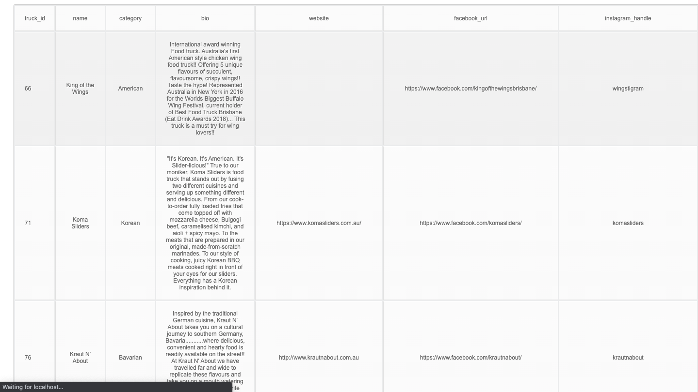
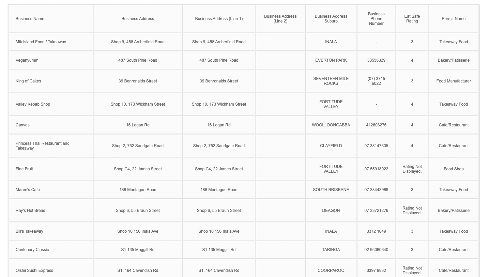

# data-aggregator

The application has been made to aggregate data from APIs and CSV files, using a node.js based server. 

# Features

The application has the following features: 

- Presents data from APIs and a CSV in a table
- Logs details of user access to data

# Tools

The application has been made using: 

- JavaScript
- Node
- NPM
- HTML
- CSS

